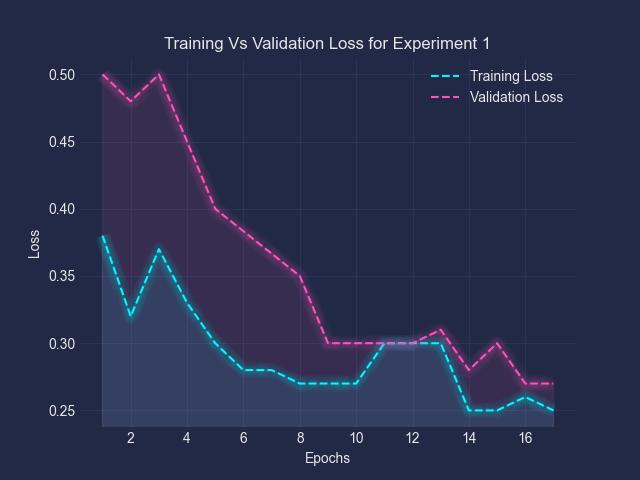

#  Evaluation Graph Generator

This project provides an automated framework to generate evaluation graphs from PyTorch model predictions. It supports various visualizations, such as accuracy plots, confusion matrices, ROC curves, and class-wise performance metrics, to help you analyze and interpret model performance effectively.




---

##  Features

- Generate multiple evaluation plots from model predictions
- Support for binary,  multi-class and **multi-label multiclass** classification
- Visualizations using `matplotlib`, `seaborn`, and `scikit-learn`
- Easy integration into model evaluation pipelines
- Outputs graphs in JPG format

---

##  Technologies Used

- Python 3.9
- PyTorch
- NumPy
- Matplotlib
- Seaborn
- scikit-learn
- SciPy

---

##  Project Structure

```
evaluation-graph/
├── example_dataset/                  # Input images folder for demo prediction and  graph creation
│   └── (auto-saved .jpg files)
├── example_models/                  # Model weights folder for demo prediction
│   └── (demo .pt files)
├── utils/  
│   ├── __init__.py   
│   ├── genral_utill.py         
│   └── inference_util.py          
├── models/                 
│   ├── __init__.npy
│   ├── custom_models.npy
│ 
├── config.yaml # model and experiment config
├── Dockerfile  
├── download_model.sh  # Bash script to dowload example models 
├── entrypoint.sh   # Bash script to run the project 
├── evaluate.py 
├── example_data.yaml    # Example data for training vs validation loss graph
├── main.py   # Entry point python script to generate all plots
├── prepare_test_data.py                  
├── requirements.txt         # Python dependencies
└── README.md                # Project documentation

```

---

##  Installation

1. Clone the repository:

```bash
git clone https://github.com/your-username/evaluation-graph.git
cd evaluation-graph
```

```bash
python -m venv venv
source venv/bin/activate  # On Windows: venv\Scripts\activate
```
```bash
pip install -r requirements.txt
```

##  Execution

1. Download example models
```bash
bash ./download_model.sh 
```
2. Prepare example data 

```bash
python prepare_test_data.py 
```

3. Run the main.py 
```bash
python main.py 
```

Or instead of preparing the data then executing main.py ( Step 2 and 3 ) you can just run 

```bash
bash ./entrypoint.sh 
```

## Usage 

1. You can add your custom model in 
```
├── models/
│   ├── custom_models.npy

```
2. Add your model to be called in the  ***get_model()*** function like following  

```
def get_model(config):
    name = config["name"]
    classes = config["classes"]
    if name == "custom":
        return customModel(classes)

```
3. Add model name, checkpoints path, test set path, the type of test set you will use in the config file as well 

```
name: 'custom '
checkpoints_path: './example_models/' # Path to the directory where models are saved
test_set_path: './example_dataset/'
test_set_type: 'csv' # Possible values ['csv', 'folder']
test_set_csv_path: './example_dataset/labels.csv' # '
```

